# Dynamic Presentation

Dynamic Presentation adds behavior on top of reveal.js to
make it easy to present musicXML files.

## Design

The code is primarily written as a few classes.

- **RevealMusicArranger**: reveal.js plugin to load a musicXML file, and return it several times with different transformation instructions.
- **RevealMusicXML**: reveal.js plugin containing a rendering toolkit and a transformation library. Loads a musicXML file, transforms it with the transformer, controls rendering toolkits to output slides.
- **MusicXMLTransformer**: Generic JavaScript library to perform transformations on the musicXML.
- **TextOnlyToolkit**: Rendering toolkit to create slides with just text.
- **PianoRollToolkit**: Rendering toolkit to create "simplified" piano roll notation.
- **VerovioLineWrapper**: Rendering toolkit: wrapper around the Verovio toolkit that renders multiple systems per page.
- **Verovio**: Rendering toolkit: Music Notation library maintained by RISM-CH.



## Usage

After installing this package with npm, you need to load the JavaScript files,
and your document object model needs to look like

```html
<html>
  <head>
    <!-- Load JS and CSS. -->
  </head>
  <body>
    <div class="reveal">
      <div class="slides">
        <section data-musicarranger="path/to/file.musicxml"></section>
      </div>
    </div>
  </body>
</html>
```

- `slides.js` Initializes reveal.js. This file can be rewritten to change reveal.js options
  (`parallaxBackgroundImage`, `transition`, etc).
- `LoadRevealMusicXML.js` Loads RevealMusicArranger and RevealMusicXML with a specified toolkit.
  This file should be rewritten to load the correct toolkit (instead of checking urlParam()).

reveal.js and everything that depends on it should be loaded with the `defer` attribute.

## Development

Make sure you have the dependencies with

```sh
git submodule update --init --recursive
npm install
```

`npm run run` starts serving the directory.

You can also start this as a dart project.

Assets (SCSS styles) can be recompiled with `npm run compile`.

## [Core Understanding Test (CUT)](//gitlab.ccel.org/drupal/shared-modules/wikis/Core-Understanding-Test)

- How do `RevealMusicArranger` and `RevealMusicXML` interact with reveal.js?
- What is the role of a toolkit in Dynamic Presentation?
- How is audio generated and played by the toolkits?
- Why does the `VerovioLineWrapper` exist?
- Why doesn't Dynamic Presentation depend on the official repository for reveal.js?
- How can Dynamic Presentation access enhancements to Verovio?
